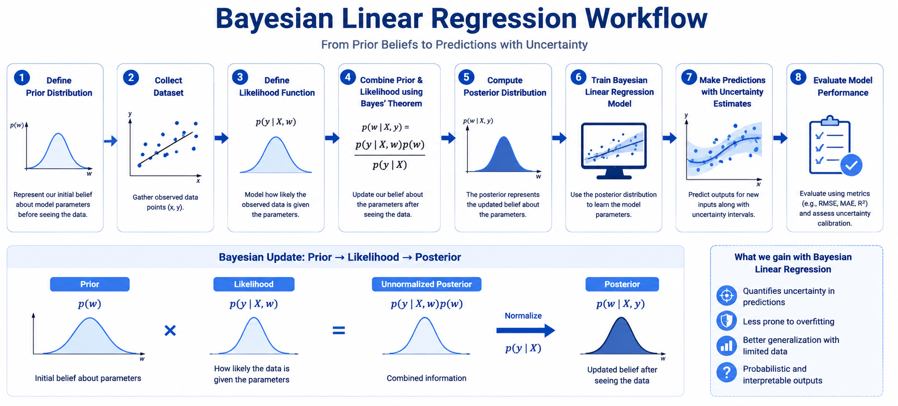

# Bayesian Linear Regression

> **Don't just predict — predict with confidence.**

This README teaches you how Bayesian Linear Regression works, how it differs from classical regression, and how to apply it in practice. By the end, you will understand how to reason about uncertainty in your predictions, connect the math to intuition, and answer FAANG-level interview questions on the topic.

---

## What Is Bayesian Linear Regression?

Imagine you are a weather forecaster. After just two days of data, you are not very confident in your forecast — there are many possible models that fit those two points. As you collect more observations, your confidence grows, your range of plausible forecasts narrows, and your predictions sharpen. This is exactly the intuition behind Bayesian Linear Regression (BLR): instead of committing to a single set of model weights, you maintain a *distribution* over all plausible weights and update it as you see more data.

Classical Ordinary Least Squares (OLS) regression finds one fixed set of weights that best fits the training data. It gives you a point estimate — a single line through your data — with no measure of how confident that estimate is. BLR replaces this with a full probability distribution over weights. Before seeing any data, you encode your prior belief about the weights (for example, "weights are probably small"). After seeing the data, Bayes' theorem combines that prior with the likelihood of the observed data to produce a *posterior distribution* — your updated belief about the weights.

The practical payoff is that every prediction comes with a built-in confidence interval. In regions where training data is dense, the model is confident and the interval is narrow. In regions far from the training data, the model knows it is guessing, and the interval widens accordingly. This calibrated uncertainty is invaluable in high-stakes settings like medical diagnosis, financial forecasting, and autonomous systems.

---

## Mathematical Formulation

### Setup

| Symbol | Meaning |
|--------|---------|
| `X` | Training feature matrix, shape (N × D) |
| `y` | Target vector, shape (N × 1) |
| `w` | Weight vector — treated as a *random variable* |
| `α` | Precision of the prior (inverse variance of weights) |
| `β` | Precision of the noise (inverse variance of observations) |
| `μₙ` | Posterior mean of weights |
| `Σₙ` | Posterior covariance of weights |

### Prior over weights

```
p(w) = N(w | 0, α⁻¹ I)
```

We assume weights are drawn from a zero-mean Gaussian. The hyperparameter α controls how tightly concentrated this prior is — a large α means we believe weights are close to zero.

### Likelihood of observations

```
p(y | X, w) = N(y | Xw, β⁻¹ I)
```

Each observed target is the dot product of the input with weights, plus Gaussian noise with precision β.

### Posterior distribution (closed form)

```
p(w | X, y) = N(w | μₙ, Σₙ)

Σₙ = (αI + β XᵀX)⁻¹
μₙ = β Σₙ Xᵀy
```

**Significance:** Because both the prior and likelihood are Gaussian, their product (the unnormalized posterior) is also Gaussian — this is the *conjugacy* property. The result is a closed-form posterior that requires no sampling or approximation.

### Predictive distribution for a new point x*

```
p(y* | x*, X, y) = N(y* | μₙᵀ x*, σ²(x*))

σ²(x*) = β⁻¹ + x*ᵀ Σₙ x*
```

**Significance:** The predictive variance has two terms. The first (β⁻¹) is irreducible noise — it exists no matter how much data you collect. The second (x*ᵀ Σₙ x*) is model uncertainty — it shrinks as you gather more data and grows in regions that are far from the training distribution. This is the formal decomposition of *aleatoric* (noise) and *epistemic* (model) uncertainty.

---

## How It Works — Step by Step

<!-- DIAGRAM PLACEHOLDER: BLR flow — Prior → Likelihood → Posterior → Predictive Distribution -->

1. **Set your prior.** Choose α. This encodes your belief about weight magnitudes before seeing any data. A weak prior (small α) lets the data dominate. A strong prior (large α) regularizes heavily.

2. **Observe data.** Collect your (X, y) pairs. Each observation is a new piece of evidence.

3. **Compute the posterior.** Apply the closed-form equations for Σₙ and μₙ. The posterior mean μₙ is your best single estimate of the weights (analogous to Ridge regression). The posterior covariance Σₙ captures how uncertain you still are.

4. **Make predictions.** For a new input x*, compute the predictive mean (μₙᵀ x*) and the predictive variance (σ²(x*)). The mean is your prediction; the variance is your confidence.

5. **Update sequentially (optional).** If new data arrives, the current posterior becomes the new prior. Repeat from step 2. This online learning property makes BLR naturally suited to streaming data.

**Simple analogy:** Think of a coin fairness estimation. You start with a prior (50/50). Each flip updates your belief. After 3 heads, you lean toward "biased" but are not certain. After 300 heads, you are very certain. BLR does the same thing for regression weights.

---

## Key Assumptions

| Assumption | What happens if violated |
|------------|--------------------------|
| **Gaussian prior on weights** | The posterior is no longer Gaussian and no closed form exists; you must resort to variational inference or MCMC |
| **Gaussian noise in observations** | The likelihood changes; heavy-tailed noise (e.g., Laplacian) requires a different likelihood model |
| **Linear relationship between X and y** | Predictions are biased; fix by applying basis function expansion (polynomial, RBF) before running BLR |
| **Noise precision β is known** | In practice β is often unknown; estimate it via marginal likelihood maximisation (Evidence framework) |
| **Features are not perfectly collinear** | XᵀX becomes near-singular; Σₙ computation is numerically unstable — regularise with a stronger prior (larger α) |

---

## When to Use / When Not to Use

| ✅ Use BLR when… | ❌ Avoid BLR when… |
|-----------------|-------------------|
| Data is limited and uncertainty quantification matters | You have very large datasets (N > 10⁵) — matrix inversion is O(D³) |
| You need calibrated confidence intervals around predictions | The true relationship is strongly non-linear and basis expansion is impractical |
| You want a principled way to incorporate domain knowledge via the prior | Your noise is clearly non-Gaussian (e.g., count data, binary outcomes) |
| You need online / sequential learning from streaming data | You need maximum raw predictive accuracy over interpretability |
| You are building a Bayesian Optimisation surrogate model | You have no good basis for choosing a prior — a flat, uninformative prior gives similar results to OLS |

---

## Implementation Overview

<!-- DIAGRAM PLACEHOLDER: From-scratch vs library pipeline comparison -->

### (a) From scratch — NumPy

The core steps map directly to the math. You construct the posterior precision matrix `(αI + β XᵀX)`, invert it to get Σₙ, then multiply to get μₙ. The predictive mean and variance follow from a single matrix-vector product. This approach is transparent and the best way to build intuition. The bottleneck is the matrix inversion, which scales as O(D³) in the number of features.

```python
from sklearn.linear_model import BayesianRidge

model = BayesianRidge(alpha_1=1e-6, alpha_2=1e-6, lambda_1=1e-6, lambda_2=1e-6)
model.fit(X_train, y_train)
y_pred, y_std = model.predict(X_test, return_std=True)
```

### (b) Library — scikit-learn / PyMC

`sklearn.linear_model.BayesianRidge` handles hyperparameter estimation automatically via the Evidence (marginal likelihood) framework — you do not need to hand-tune α and β. For more complex models with non-standard priors or non-Gaussian likelihoods, PyMC lets you specify the full probabilistic model and sample the posterior using HMC.

**Key difference:** The from-scratch approach builds conceptual clarity and is exact. The library approach is production-ready, numerically robust, and handles hyperparameter selection automatically.

---

## Top 5 Interview Questions

**Q1. How does BLR differ from OLS and Ridge? When does each reduce to the other?**
- OLS: point estimate, no prior, no uncertainty
- Ridge: MAP estimate under a zero-mean Gaussian prior — identical to μₙ
- BLR: full posterior, adds uncertainty quantification on top of Ridge
- Key insight: Ridge regression *is* BLR with the covariance thrown away

**Q2. Walk through the posterior equations. Why is the result Gaussian?**
- Conjugacy: Gaussian prior × Gaussian likelihood = Gaussian posterior
- Σₙ = (αI + β XᵀX)⁻¹ — posterior shrinks as more data arrives (XᵀX grows)
- μₙ = β Σₙ Xᵀy — posterior mean is a precision-weighted combination of prior and data
- The α term in Σₙ is exactly the L2 regularisation term in Ridge

**Q3. What does predictive variance represent? Explain aleatoric vs. epistemic uncertainty.**
- Aleatoric (β⁻¹): irreducible noise, cannot be reduced with more data
- Epistemic (x*ᵀ Σₙ x*): model uncertainty, shrinks with more data, grows far from training data
- Practical impact: uncertainty bands widen at the edges of the input domain — the model correctly signals when it is extrapolating

**Q4. How does sequential/online Bayesian updating work?**
- After seeing batch 1: compute posterior p(w | X₁, y₁)
- This posterior becomes the prior for batch 2
- After seeing batch 2: compute updated posterior p(w | X₁, y₁, X₂, y₂)
- Structural identity: this is mathematically identical to a Kalman Filter update step
- Enables real-time learning without re-training from scratch

**Q5. When would you choose BLR over a Gaussian Process or MC Dropout?**
- BLR vs GP: BLR scales as O(D³), GP scales as O(N³). Prefer BLR when features are low-dimensional; prefer GP when you want a non-parametric kernel and N is manageable
- BLR vs MC Dropout: BLR is exact (closed form), interpretable, and data-efficient; MC Dropout approximates uncertainty in deep networks but requires many forward passes
- Decision rule: limited data + linear assumption → BLR; complex non-linear patterns → GP or BNN

---

## Quick Reference Table

| Property | Value |
|----------|-------|
| **Algorithm type** | Probabilistic supervised regression |
| **Prediction output** | Distribution — mean + variance per prediction |
| **Training time complexity** | O(ND² + D³) — matrix inversion dominates |
| **Prediction time complexity** | O(D) per sample |
| **Space complexity** | O(D²) — storing the D×D posterior covariance |
| **Key hyperparameters** | α (prior precision), β (noise precision) |
| **Hyperparameter tuning** | Evidence maximisation (type-II MLE) or cross-validation |
| **Evaluation metrics** | RMSE, MAE (point), NLL / CRPS (probabilistic), calibration curves |
| **Scalability** | Exact inference limited to D < ~10³; use sparse or variational methods beyond that |

---

## References & Further Reading

1. **Bishop, C. M. — *Pattern Recognition and Machine Learning*, Chapter 3** — The definitive treatment of BLR with full derivations. Chapter 3.3 covers the evidence framework for hyperparameter selection.

2. **Murphy, K. P. — *Probabilistic Machine Learning: An Introduction*, Chapter 11** — Modern, code-forward treatment. Freely available at [probml.github.io](https://probml.github.io).

3. **Rasmussen & Williams — *Gaussian Processes for Machine Learning*** — The natural next step after BLR; shows how BLR in an infinite feature space becomes a GP. Free PDF at [gaussianprocess.org](http://www.gaussianprocess.org/gpml/).

4. **scikit-learn docs — BayesianRidge** — [sklearn.linear_model.BayesianRidge](https://scikit-learn.org/stable/modules/linear_model.html#bayesian-regression) — Concise practical guide with the evidence framework explained.

5. **Distill.pub / Betancourt — *A Conceptual Introduction to Hamiltonian Monte Carlo*** — Essential reading once you want to move beyond conjugate models to full probabilistic programming with PyMC.

## Bayesian Linear Regression Workflow



*Figure: End-to-end workflow of Bayesian Linear Regression using Bayes' theorem.*

### Real-World Example
Estimating house prices while also understanding the uncertainty in predictions.

### Analogy
It is like updating your beliefs after receiving new evidence.