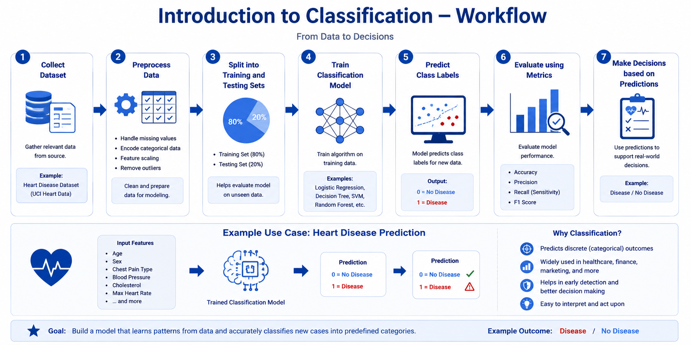

# 🤖 Introduction to Classification

> **Topic:** Supervised Machine Learning | **Level:** Beginner–Intermediate
> **Series:** ML Study Material | Based on FAANG placement scope

[]()
[]()
[]()

---

## 📌 What is Classification?

Classification is a supervised learning task where a model learns to assign a **label** (category) to an input based on patterns it has seen in labeled training data.

**Real-world analogy:** A doctor looks at symptoms (input) and decides whether a patient has flu or not (label). The doctor's past experience with hundreds of patients is the "training data."

> **Key distinction:** Classification predicts a *category*. Regression predicts a *number*.
> - "Will this email be spam?" → Classification
> - "What will this house sell for?" → Regression

<!-- DIAGRAM PLACEHOLDER: Decision boundary separating two classes in 2D feature space -->


---

## 🔀 Types of Classification

| Type | Description | Example |
|---|---|---|
| **Binary** | Exactly 2 output classes | Spam / Not Spam |
| **Multi-Class** | 3 or more mutually exclusive classes | Digit recognition (0–9) |
| **Multi-Label** | Multiple labels can be true at once | A news article tagged as both "Politics" and "Economy" |

**Binary classification** is the foundation. Multi-class extends it using two main strategies:
- **One-vs-Rest (OvR):** Train one classifier per class against all others (k models total).
- **One-vs-One (OvO):** Train one classifier per pair of classes (k×(k−1)/2 models).

---

## ⚙️ Classification Workflow

Every classification project follows a repeatable pipeline:

```
Raw Data → EDA → Preprocessing → Model Training → Evaluation → Iterate → Deploy
```

1. **Define the problem** — What are you predicting? What are the classes?
2. **Collect & explore data** — Understand distributions, spot missing values, check class balance.
3. **Preprocess** — Encode categorical features, scale numerics, handle nulls.
4. **Split data** — Train / Validation / Test (never let test data touch training).
5. **Train a model** — Start simple (Logistic Regression), then try complex models.
6. **Evaluate** — Use the right metrics for your problem (see below).
7. **Tune & iterate** — Adjust threshold, features, or model based on results.

<!-- DIAGRAM PLACEHOLDER: End-to-end pipeline flowchart -->


---

## 📊 Evaluation Metrics

**Accuracy alone is not enough.** Always start with the confusion matrix.

<!-- DIAGRAM PLACEHOLDER: Labeled confusion matrix (TP, TN, FP, FN) -->


| Metric | Formula | When to Use |
|---|---|---|
| **Accuracy** | (TP + TN) / Total | Balanced classes only |
| **Precision** | TP / (TP + FP) | When false positives are costly (e.g., spam filter) |
| **Recall** | TP / (TP + FN) | When false negatives are costly (e.g., cancer detection) |
| **F1-Score** | 2 × (P × R) / (P + R) | Imbalanced classes, need balance of P & R |
| **AUC-ROC** | Area under ROC curve | Comparing models; threshold-independent |

> 💡 **Rule of thumb:** In medical diagnosis, maximize **Recall** (catch every case). In spam filtering, maximize **Precision** (don't block real emails).

---

## ⚠️ Challenges in Classification

| Challenge | What It Looks Like | Fix |
|---|---|---|
| **Class Imbalance** | 99% not-fraud, 1% fraud — model predicts "not fraud" always | Resampling (SMOTE), class weights, better metrics |
| **Data Leakage** | 98% accuracy in testing, 60% in production | Strict train/test separation; audit features carefully |
| **Overfitting** | Near-perfect training accuracy, poor test accuracy | Regularization, more data, simpler model |
| **Poor Threshold** | Default 0.5 may not fit your business need | Tune threshold using PR curve |

---

## ✅ When to Use / When Not to Use

**Use Classification when:**
- The output is a discrete category (yes/no, A/B/C).
- You have labeled training examples for each class.
- Examples: fraud detection, disease diagnosis, sentiment analysis, image recognition.

**Avoid Classification when:**
- The output is a continuous value → use **Regression**.
- You have no labels → use **Clustering** (unsupervised).
- Classes are extremely rare (< 0.01%) → consider **Anomaly Detection**.

---

## 💻 Implementation Overview

A minimal classification pipeline in Python using scikit-learn:

```python
from sklearn.linear_model import LogisticRegression
from sklearn.metrics import classification_report
from sklearn.model_selection import train_test_split

# 1. Split
X_train, X_test, y_train, y_test = train_test_split(X, y, test_size=0.2, random_state=42)

# 2. Train
model = LogisticRegression()
model.fit(X_train, y_train)

# 3. Evaluate
y_pred = model.predict(X_test)
print(classification_report(y_test, y_pred))
```

> Full worked examples with datasets are in the [`/notebooks`](notebooks/) folder.

---

## 🎯 Top 5 Interview Questions

1. **Imbalance trap:** *"Your fraud model has 99.9% accuracy. Is it good? What would you do?"*
   → Discuss precision/recall/F1, class weights, resampling strategies.

2. **Business tradeoff:** *"A doctor wants to catch every cancer case. An administrator wants to reduce unnecessary tests. How do you design the model?"*
   → Precision vs. recall tradeoff, threshold tuning, F-beta score.

3. **Multi-class strategy:** *"When would you choose One-vs-Rest over One-vs-One?"*
   → Computational cost (k vs k²), class imbalance effects per sub-problem.

4. **Leakage diagnosis:** *"Model scored 98% AUC offline, 61% in production. What happened?"*
   → Temporal leakage, feature leakage, distribution shift — systematic debugging.

5. **AUC misuse:** *"Model A has AUC 0.85, Model B has 0.87. Which do you pick?"*
   → AUC is aggregate; the operating point matters more than the overall score.

---

## 📋 Quick Reference Table

| Concept | One-liner |
|---|---|
| Classification | Predict a discrete label from input features |
| Binary | Two classes (0 or 1) |
| Multi-class | Three or more classes |
| Confusion Matrix | Foundation of all classification metrics |
| Precision | How often positive predictions are correct |
| Recall | How many actual positives were caught |
| F1-Score | Harmonic mean of precision and recall |
| AUC-ROC | Model's ability to rank positives above negatives |
| Class Imbalance | When one class vastly outnumbers others |
| Data Leakage | When future/target information contaminates training |
| Decision Threshold | Cutoff (default 0.5) to convert probability → class |

---

## 📚 References

- [Scikit-learn: Classification](https://scikit-learn.org/stable/supervised_learning.html)
- [Google ML Crash Course: Classification](https://developers.google.com/machine-learning/crash-course/classification)
- Bishop, C. M. — *Pattern Recognition and Machine Learning* (2006)
- Hastie, Tibshirani & Friedman — *The Elements of Statistical Learning* (2009)
- [ROC and AUC Explained — Google Developers](https://developers.google.com/machine-learning/crash-course/classification/roc-and-auc)

---

*Part of the ML Study Series | Next →* ***Logistic Regression (Deep Dive)***

## Classification Workflow



*Figure: Workflow of a classification problem from data collection to decision-making.*

### Real-World Example
Predicting whether a patient has heart disease based on medical information.

### Analogy
Like sorting emails into "Spam" and "Not Spam."